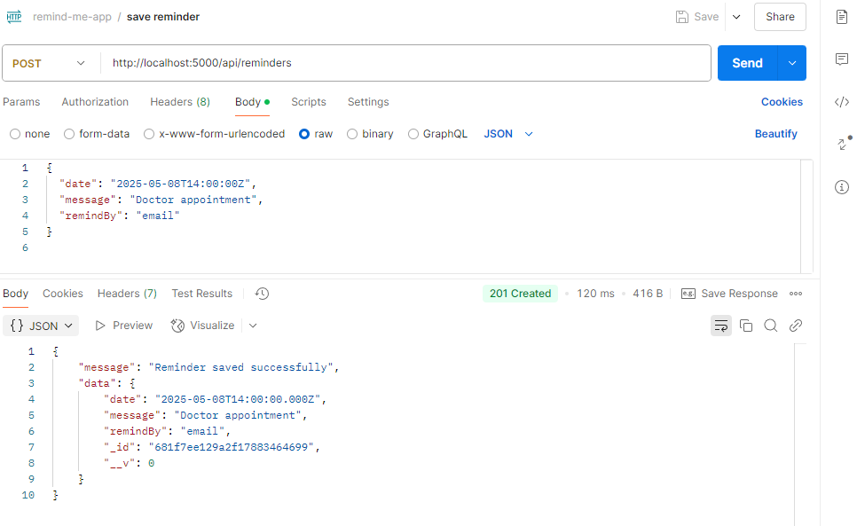

# remind-me-later-api
An api which takes the data from frontend and saves it in the database
This project is a simple Node.js and Express API that allows users to schedule reminders with a message and preferred reminder method (Email or SMS). The reminders are stored in a MongoDB Atlas database. The frontend can call this API to save reminder details — no actual delivery is implemented.
